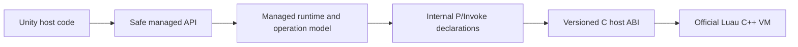

# Agent Guide

## Repository Direction

This repository is a Unity-first Luau engine. Treat
`src/Luau.Unity/Assets/Luau.Unity` as the product surface. The .NET solution is a
fast build and test harness over the same managed implementation; it is not a
separate distribution.

The official native Luau VM remains part of the product. The final dependency
flow is:



## Authority Boundaries

- `luau/`: exact pinned official Luau C++ submodule.
- `native/luau-host/`: sole native build and the versioned `luau_host_*` ABI.
- `src/Luau.Unity/Assets/Luau.Unity/Interop/`: sole C# interop authority. The
  `Luau.Interop` assembly uses the internal namespace `Luau.Internal.Interop`
  and contains only direct declarations for `luau_host_*`.
- `src/Luau/`: canonical source for the prebuilt Release `Luau.dll`.
- `src/Luau.SourceGenerator/`: the attribute-driven `[LuauLibrary]` /
  `[LuauMember]` generator.
- `tools/harness/`: .NET adapter that links the package interop source and
  supplies harness-only native artifact behavior.
- `tests/Luau.Tests/`: primary fast managed behavior suite.
- `src/Luau.Unity/Assets/Luau.Unity/Tests/`: Unity-specific EditMode coverage.

There is no duplicate interop tree, compatibility P/Invoke facade,
location-based call-site generator, filesystem resolver, desktop CLI, or console
sample. Do not recreate any of them.

## Native Build

`native/luau-host/CMakeLists.txt` is the only native build entry point. It
verifies the clean pinned submodule, links the required upstream libraries,
builds `luau_host`, and audits the final binary against the checked-in 85-symbol
export allowlist.

`native/luau-host/include/luau_host.h` and the package's direct C# declarations
form one compatibility unit. Keep the header, package interop, ABI/layout tests,
managed ABI verifier, and export allowlist synchronized. Do not introduce
binding generation, a second native build system, or broad upstream `lua_*`
exports.

Run presets from `native/luau-host`:

```powershell
cmake --preset windows-x64
cmake --build --preset windows-x64 --parallel
ctest --preset windows-x64

cmake --preset android-arm64
cmake --build --preset android-arm64 --parallel

cmake --preset android-x64
cmake --build --preset android-x64 --parallel
```

Android builds use `ANDROID_NDK_HOME` and NDK `27.2.12479018`.

## Maintained Unity Targets

- `win-x64/luau_host.dll`: Windows Editor and Win64 player.
- `android-arm64/libluau_host.so`: Android ARM64 player.
- `android-x64/libluau_host.so`: Android x64 emulator.

Only Windows x64 and Android ARM64/x64 are maintained. Import-name branches for
other Unity platforms are not support claims. Preserve the matching plugin
`.meta` importer settings whenever a native artifact changes.

Unity resolves plugins through importer metadata. Harness-only native loading
must stay under `tools/harness`; never add a generic .NET resolver to product
runtime code.

## Managed Architecture

- `Luau.dll` remains a deterministic prebuilt Release artifact. Direct source
  shipping was rejected because it adds Unity compiler and dependency
  complexity for no product benefit.
- The artifact targets `netstandard2.1`; net9 test executables consume that same
  implementation.
- The explicit managed artifact command builds, checks, and refreshes only
  `Luau.dll` and `Luau.SourceGenerator.dll`. Interop source is never copied.
- Manual callbacks use a generation-checked `LuauCallContext`. Argument indexes
  are zero-based; `Read<T>`, `Return<T>`, and cancellation are safe callback-
  scoped operations. Do not expose raw stack or native handles.
- `[LuauLibrary]` and `[LuauMember]` are the only generated host API model.
- `ScriptOperation` and `ScriptRunner` form the one operation engine. Top-level
  resume, nested managed require, and direct host operations share one stack
  boundary and failure precedence: hard stop, callback failure, then
  allocator/native failure.
- `require()` remains managed and opt-in. Do not link upstream native Require.

## Build and Test

From the repository root:

```powershell
# Fast managed validation; does not mutate package artifacts.
dotnet test Luau.slnx --no-restore

# Explicit Release artifact refresh/check.
powershell -ExecutionPolicy Bypass -File tools/Copy-DotNetArtifactsToUnity.ps1 -Configuration Release

# Unity validation.
Push-Location src/Luau.Unity
ucp compile
ucp run-tests --mode edit
Pop-Location
```

Build native plugins separately and install them deliberately. Ordinary .NET
builds and tests must never rewrite package files.

## Unity Control Protocol

The Unity project is `src/Luau.Unity` and currently uses Unity `6000.3.19f1`.
Before Unity-side work, read `.agents/skills/unity-control-protocol/SKILL.md`.
Run `ucp` with `src/Luau.Unity` as the working directory so project discovery
works without `--project`. Do not set a user- or machine-wide `UCP_PROJECT`.

## Agent Rules

- Keep product runtime changes under `src/Luau.Unity/Assets/Luau.Unity` or its
  canonical managed source in `src/Luau`.
- Prefer .NET tests for cross-platform VM behavior; add Unity-only tests for
  Unity integration and IL2CPP behavior.
- Do not commit `Library/`, `Temp/`, `Logs/`, `Builds/`, or `Assets/**/obj/`.
- Do not add packaging for a separate managed product, desktop product APIs,
  filesystem module loading, retired tools, or target-framework permutations.
- If a native ABI defect is discovered during managed work, isolate it as a
  separately reviewed native compatibility change.
