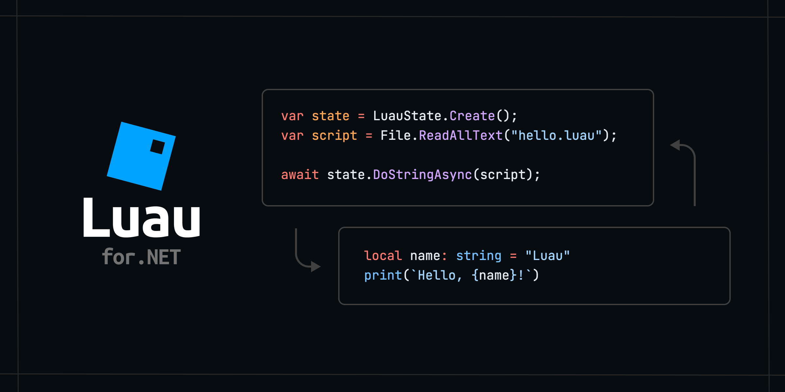
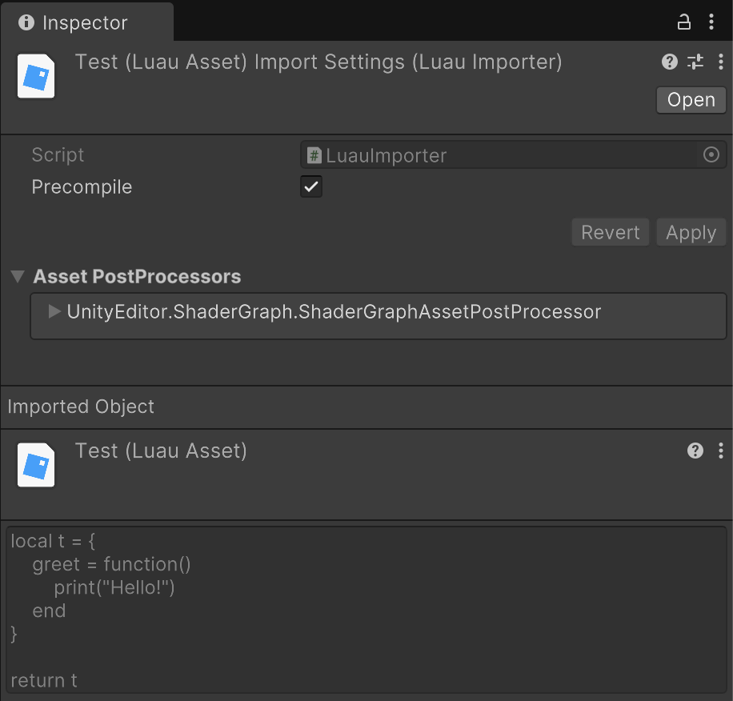

# Luau for .NET
 High-level Luau bindings for .NET and Unity



[](https://www.nuget.org/packages/Luau)
[](https://github.com/nuskey8/luau-dotnet/releases)
[](LICENSE)

English | [日本語](./README_JA.md)

## Overview

Luau for .NET is a library that enables embedding of the [Luau language](https://luau.org/) into .NET / Unity. It provides both a high-level API with flexible and high-performance async/await support, and a low-level API that is a binding to the C API. Additionally, CLI tools for REPL and type definition file generation are also provided.

> [!CAUTION]
> This library is currently provided as a preview version. While many APIs are already stable, some features are not yet implemented.

## Why Luau?

Lua is a language specialized for embedding into applications, but it has issues such as limited language features and difficulty in static analysis due to dynamic typing. Luau, a language derived from Lua, can utilize a type system similar to TypeScript, and many convenient syntax and libraries have been added. Additionally, Luau is a language with proven track record at Roblox, its developer, and is more actively maintained compared to Lua. (Lua has not been updated since 5.4)

Furthermore, Luau focuses on providing a sandboxed environment. Dangerous APIs such as the io library are removed in advance, making it superior to Lua in terms of safety.

Additionally, Luau is optimized for performance in AOT environments and can run on a very fast interpreter. Therefore, it can be used without issues even in environments where JIT is not permitted.

For detailed information about Luau, please refer to the [official documentation](https://luau.org/why).

## Platforms

Luau for .NET supports the following platforms.

| Platform | Architecture            | Support | Notes |
| -------- | ----------------------- | ------- | ----- |
| Windows  | x64                     | ✅       |       |
|          | arm64                   | ❌       | WIP   |
| macOS    | x64                     | ✅       |       |
|          | arm64 (Apple Silicon)   | ✅       |       |
|          | Universal (x64 + arm64) | ✅       |       |
| Linux    | x64                     | ✅       |       |
|          | arm64                   | ✅       |       |
| iOS      | arm64                   | ✅       |       |
|          | x64                     | ✅       |       |
| Android  | arm64                   | ✅       |       |
|          | x64                     | ✅       |       |
| WebGL    | wasm32                  | ✅       |       |

## Installation

### NuGet packages

To use Luau for .NET, .NET Standard 2.1 or higher is required. Packages can be obtained from NuGet.

### .NET CLI

```ps1
dotnet add package Luau
```

### Package Manager

```ps1
Install-Package Luau
```

### Unity

For Unity, installation from Package Manager is possible.

1. Open Package Manager from Window > Package Manager
2. Click the "+" button > Add package from git URL
3. Enter the following URL

```
https://github.com/nuskey8/luau-dotnet.git?path=src/Luau.Unity/Assets/Luau.Unity
```

Alternatively, open Packages/manifest.json and add the following to the dependencies block

```json
{
    "dependencies": {
        "com.nuskey.luau.unity": "https://github.com/nuskey8/luau-dotnet.git?path=src/Luau.Unity/Assets/Luau.Unity"
    }
}
```

Adding the [System.Runtime.CompilerServices.Unsafe](https://www.nuget.org/packages/System.Runtime.Compilerservices.Unsafe/) and [System.Text.Json](https://www.nuget.org/packages/System.Text.Json) DLLs as dependencies to your project is also necessary. You can do this by using [NugetForUnity](https://github.com/GlitchEnzo/NuGetForUnity) or by renaming the `.nupkg` file you installed from NuGet to `.zip`, unzipping the folder, and then adding the DLLs from the folder to your Unity project.

## Quick Start

You can execute Luau scripts from C# using `LuauState`.

```cs
using Luau;

using var state = LuauState.Create();
var results = state.DoString("return 1 + 1");
Console.WriteLine(results[0]); // 2
```

> [!WARNING]
> `LuauState` is not thread-safe. Do not access it from multiple threads simultaneously.

## LuauValue

Values in Luau scripts are represented by the `LuauValue` type. Values of `LuauValue` can be read using `TryRead<T>(out T value)` or `Read<T>()`.

```cs
var results = state.DoString("return 1 + 1");

// double
var value = results[0].Read<double>();
```

You can also get the type of the value from the `Type` property.

```cs
var results = state.DoString("return 'hello'");
Console.WriteLine(results[0].Type); // string
```

The correspondence between Lua and C# types is shown below.

| Luau            | C#                        |
| --------------- | ------------------------- |
| `nil`           | `LuaValue.Nil`            |
| `boolean`       | `bool`                    |
| `lightuserdata` | `IntPtr`                  |
| `number`        | `double`, `float`         |
| `vector`        | `System.Numerics.Vector3` |
| `string`        | `string`                  |
| `table`         | `LuauTable`               |
| `function`      | `LuauFunction`            |
| `userdata`      | `T, LuauUserData`         |
| `thread`        | `LuauState`               |
| `buffer`        | `LuauBuffer`              |

When creating `LuauValue` from the C# side, convertible types are implicitly converted to `LuauValue`.

```cs
LuauValue value;
value = 1.2;                 // double   ->  LuauValue
value = "foo";               // string   ->  LuauValue
value = state.CreateTable(); // LuaTable ->  LuauValue
```

### LuauTable

Luau's `table` type is represented by `LuauTable`.

```cs
var results = state.DoString("return { a = 1, b = 2, c = 3 }");
var table = results[0].Read<LuauTable>();

Console.WriteLine(table["a"]); // 1

foreach (KeyValuePair<LuauValue, LuauValue> kv in table)
{
    Console.WriteLine($"{kv.Key}:{kv.Value}");
}
```

You can also create tables from the C# side.

```cs
LuauTable table = state.CreateTable();
table["a"] = "alpha";

state["t"] = table;
var results = state.DoString("return t['a']");
Console.WriteLine(results[0]); // alpha
```

### LuauUserData

You can pass C# structs to Luau as UserData. Structs used as UserData must be unmanaged (not contain references).

To create UserData, use `state.CreateUserData<T>()`. The returned `LuauUserData` is a handle that holds information such as pointers and sizes of UserData.

```cs
LuauUserData userdata = state.CreateUserData<Example>(new()
{
    Foo = 5,
    Bar = 1.5,
});

struct Example
{
    public int Foo;
    public double Bar;
}
```

`LuauValue` representing UserData can be read directly using `Read<T>()`.

```cs
var value = state["example"]; // userdata
var example = value.Read<Example>();
```

### LuauBuffer

Luau's `buffer` type is represented by `LuauBuffer`.

```cs
var results = state.DoString("return buffer.fromstring('hello')");
var buffer = results[0].Read<LuauBuffer>();

Console.WriteLine(Encoding.UTF8.GetString(buffer.AsSpan())); // hello
```

You can also create buffers from the C# side.

```cs
var buffer = state.CreateBuffer(10);

var span = buffer.AsSpan();
span[0] = (byte)'1';
span[1] = (byte)'2';
span[2] = (byte)'3';
span[3] = (byte)'4';
span[4] = (byte)'5';
"hello"u8.CopyTo(span[5..]);

state["b"] = buffer;
var results = state.DoString("return buffer.tostring(b)");
Console.WriteLine(results[0]); // 12345hello
```

## Global Variables

Luau's global variables can be read and written through the indexer of `LuauState`.

```cs
state["a"] = 10;
var results = state.DoString("return a");
Console.WriteLine(results[0]);
```

## Synchronous/Asynchronous API

`LuauState` provides both synchronous and asynchronous APIs for executing Luau scripts.

```cs
using var state = LuauState.Create();

// sync
state.DoString("foo()");

// async
await state.DoStringAsync("foo()");
```

The synchronous API is superior in terms of performance and ease of use, but if the Luau script to be executed contains asynchronous functions defined on the C# side, an exception will occur when executing it with the synchronous API. Use the asynchronous API when including asynchronous processing.

## Functions

Lua functions are represented by the `LuauFunction` type. Using `LuauFunction`, you can call Luau functions from the C# side or call functions defined in C# from the Luau side.

### Calling Luau Functions from C#

```lua
-- sample.luau

local function add(a: number, b: number): number
    return a + b
end

return add
```

```cs
using var state = LuauState.Create();
var bytes = await File.ReadAllBytes("sample.luau");

var func = state.DoString(bytes)[0]
    .Read<LuauFunction>();

// Execute with arguments
var results = await func.InvokeAsync([1, 2]);
Console.WriteLine(results[0]); // 3
```

### Calling C# Functions from Luau

You can create LuauFunction from lambda expressions using `CreateFunction()`. This is achieved by processing with Source Generator to generate code at compile time.

```cs
state["add"] = state.CreateFunction((double a, double b) =>
{
    return a + b;
});

// Execute on Luau side
var results = state.DoString("return add(1, 2)");
Console.WriteLine(results[0]); // 3
```

Also, the lambda expression of `CreateFunction()` can be asynchronous. When Luau includes calls to asynchronous functions, you need to use the asynchronous API for execution.

```cs
state["wait"] = state.CreateFunction(async (double seconds, CancellationToken ct) =>
{
    await Task.Delay(TimeSpan.FromSeconds(seconds), ct);
});

await state.DoStringAsync("wait(1)"); // Wait for 1 second
```

> [!TIP]
> For defining multiple functions, the use of `[LuauLibrary]` is recommended. For details, see the [LuauLibrary](#luaulibrary) section.

## Threads / Coroutines

Luau threads are represented by `LuauState`.

You can create threads that share the global environment using `state.CreateThread()`. This is convenient when executing multiple independent Luau scripts.

```cs
var thread = state.CreateThread();
thread.DoString("return 1 + 2");
```

You can also get Luau coroutines as `LuauState` and manipulate them from the C# side.

```lua
-- coroutine.luau

local co = coroutine.create(function()
    for i = 1, 10 do
        print(i)
        coroutine.yield()
    end
end)

return co
```

```cs
var bytes = File.ReadAllBytes("coroutine.luau");
var results = state.DoString(bytes);
var co = results[0].Read<LuaState>();

for (int i = 0; i < 10; i++)
{
    var resumeResults = co.Resume(state);

    // Similar to coroutine.resume(), returns true in the first element on success, followed by function return values
    // 1, 2, 3, 4, ...
    Console.WriteLine(resumeResults[1]);
}
```

## Libraries

### Standard Libraries

You can specify libraries to add to `LuauState` using the `Open~` methods.

```cs
using var state = LuauState.Create();
state.OpenBaseLibrary();
state.OpenMathLibrary();
state.OpenTableLibrary();
state.OpenStringLibrary();
state.OpenCoroutineLibrary();
state.OpenBit32Library();
state.OpenUtf8Library();
state.OpenOSLibrary();
state.OpenDebugLibrary();
state.OpenBufferLibrary();
state.OpenVectorLibrary();
```

To add all standard libraries at once, use `OpenLibraries()`.

```cs
state.OpenLibraries();
```

### Require Library

Luau's `require()` implementation is significantly different from Lua's. Luau for .NET offers corresponding C\# APIs to handle this.

The `LuauRequirer` class abstracts Luau's module resolution, allowing you to customize how `require()` loads modules by implementing it. By default, `FileSystemLuauRequirer` is provided, which searches for `*.luau` and `.luaurc` files starting from a specified directory. Additionally, implementations for loading modules from Resources and Addressables are available for Unity.

To add a Require library, call `OpenRequireLibrary()` and pass an instance of the `LuauRequirer` you want to use as an argument.

```csharp
state.OpenRequireLibrary(new FileSystemLuauRequirer
{
    WorkingDirectory = "scripts/"       // Base directory
    ConfigFilePath = "scripts/.luaurc"  // Path to .luaurc
});
```

> [!TIP]
> It's recommended to use aliases configured in your `.luaurc` for specifying paths.
>
> ```json
> {
>   "aliases": {
>      "Script": "."
>   }    
> }
> ```
>
> ```lua
> require "@Script/foo"
> ```

### LuauLibrary

You can easily create custom libraries using `[LuauLibrary]`.

```cs
// The partial keyword is required because Source Generator generates necessary code
[LuauLibrary("foo")]
partial class FooLibrary
{
    [LuauMember]
    public double field = 10;

    [LuauMember("property")]
    public double Property { get; set; } = 20;

    [LuauMember("hello")]
    public static void Hello()
    {
        Console.WriteLine("hello!");
    }

    [LuauMember("echo")]
    public static void Echo(string value)
    {
        Console.WriteLine(value);
    }

    [LuauMember("getfield")]
    public double GetField()
    {
        return field;
    }
}
```

Created libraries can be added using `OpenLibrary<T>()`.

```cs
state.OpenLibrary<FooLibrary>();
```

This can be used in Luau as follows.

```lua
print(foo.field)      -- 10
print(foo.property)   -- 20

foo.field = 50

foo.hello()           -- hello!
foo.echo("foo")       -- foo
print(foo.getfield()) -- 50
```

Additionally, you can automatically generate Luau type definition files using CLI tools. For details, see the [CLI Tools](#cli-tools) section.

## Bytecode

You can convert Luau scripts to bytecode using `LuauCompiler.Compile()`. This is convenient when you want to pre-compile Luau files.

```cs
byte[] bytecode = LuauCompiler.Compile("return 1 + 2"u8);
```

This can be loaded as `LuauFunction` using `state.Load()`.

```cs
var func = state.Load(bytecode);
var results = func.Invoke([]);
Console.WriteLine(results[0]); // 3
```

## Stack Operations

`LuauState` provides a high-level API that doesn't require complex stack operations, but APIs for directly manipulating the stack are also available.

```cs
var bytecode = LuauCompiler.Compile(
    """
    function add(a: number, b:number): number
        return a + b
    end
    """u8);

state.Load(bytecode);

// Push arguments
state.Push(state["add"]);
state.Push(10);
state.Push(20);

// Call function
state.Call(2, 1);

// Get result from stack
var result = state.ToNumber(-1);
state.Pop(1);
```

## Luau.Native

Luau's C API bindings are distributed as a separate Luau.Native package on NuGet. You can use this if you don't need the high-level API.

### Installation

#### .NET CLI

```ps1
dotnet add package Luau.Native
```

#### Package Manager

```ps1
Install-Package Luau.Native
```

#### Unity

In Unity, Luau.Native is distributed in the same package as the regular one.

### Usage

```cs 
using Luau.Native;
using static Luau.Native.NativeMethods;

unsafe
{
    lua_State* l = luaL_newstate();
    lua_pushnumber(l, 12.3);

    double v = lua_tonumber(l, -1);
    lua_pop(l, 1);

    lua_close(l);
}
```

## Unity

The Luau.Unity package includes several Unity-specific extensions in addition to the regular Luau for .NET functionality.

### LuauAsset

By introducing Luau.Unity, you can treat .luau extension files as LuauAsset.



By checking `Precompile`, you can pre-compile Luau scripts to bytecode. This significantly reduces runtime overhead.

When executing, pass LuauAsset as an argument to `state.Execute()`.

```cs
using UnityEngine;
using Luau;
using Luau.Unity;

public class Example : MonoBehaviour
{
    [SerializeField] LuauAsset script;

    void Start()
    {
        using var state = LuauState.Create();
        state.Execute(script);
    }
}
```

### Resources / Addressables

In Luau.Unity, `LuaRequirer` implementations that support Resources and Addressables*are available.

```csharp
state.OpenRequireLibrary(ResourcesLuauRequirer.Default);
state.OpenRequireLibrary(AddressablesLuauRequirer.Default);
```

However, if you want to use aliases with these Requirers, you need to explicitly pass them.

```csharp
state.OpenRequireLibrary(new ResourcesLuauRequirer
{
    Aliases =
    {
        ["Resources"] = "."
    }
});
```

## CLI Tools

Luau for .NET provides a CLI tool that can perform REPL, type checking, and more.

```ps1
dotnet tool install --global luau-cli
```

By using this, you can call tools provided by Luau, such as REPL and type checking, from the `dotnet luau` command.

```ps1
$ dotnet luau
> 1 + 2
3
```

```ps1
$ dotnet luau analyze test.luau
test.luau(1,1): TypeError: Type 'number' could not be converted into 'string'

$ dotnet luau ast test.luau
{"root":{"type":"AstStatBlock","location":"0,0 - 0,12","hasEnd":true,"body":[{"type":"AstStatReturn","location":"0,0 - 0,12","list":[{"type":"AstExprBinary","location":"0,7 - 0,12","op":"Add","left":{"type":"AstExprConstantNumber","location":"0,7 - 0,8","value":1},"right":{"type":"AstExprConstantNumber","location":"0,11 - 0,12","value":2}}]}]},"commentLocations":[]}%       

$ dotnet luau compile test.luau
Function 0 (??):
    1: return 1 + 2
LOADN R0 3
RETURN R0 1
```

Also, the `dluau` command has been added as an extension for Luau for .NET. Using this command, you can generate a type definition file based on the `[LuauLibrary]` defined in the project.

```cs
[LuauLibrary("cmd")]
partial class Commands
{
    [LuauMember]
    public double foo;

    [LuauMember]
    public void Hello()
    {
        Console.WriteLine("Hello!");
    }

    [LuauMember("echo")]
    public static void Echo(string value)
    {
        Console.WriteLine(value);
    }
}
```

```ps1
$ dotnet luau dluau Program.cs -o libs.d.luau
```

```lua
-- libs.d.luau

declare cmd:
{
    foo: number,
    Hello: () -> (),
    echo: (value: string) -> (),
}
```

## License

This library is provided under the [MIT License](LICENSE).