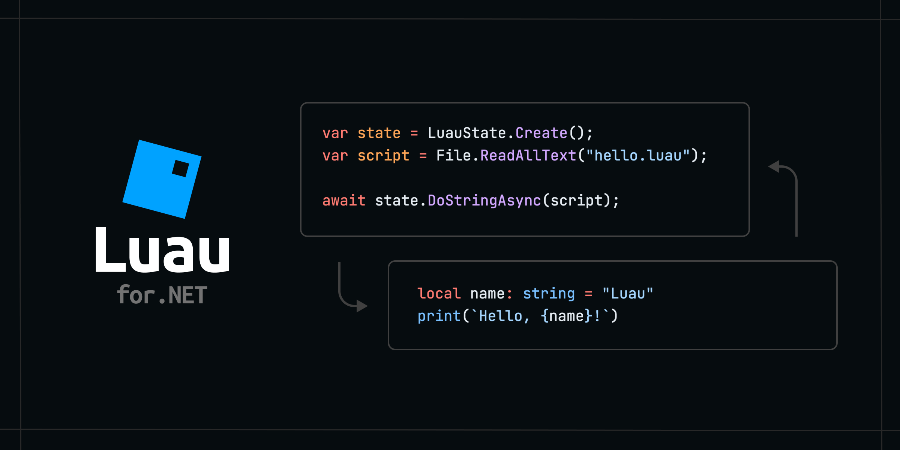
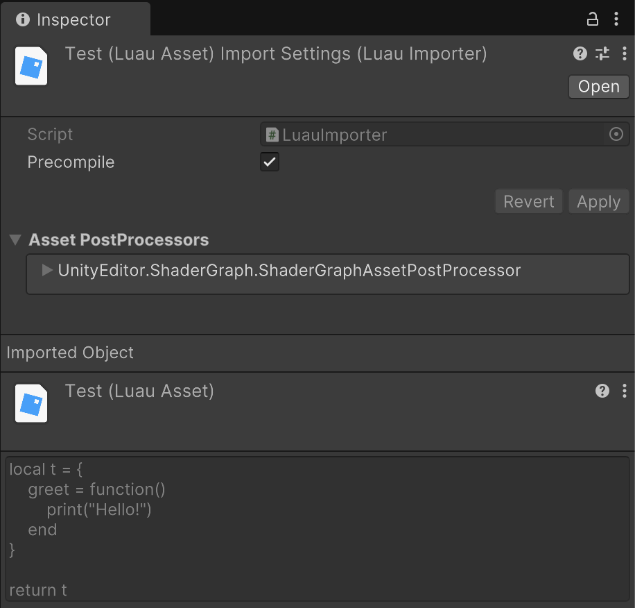

# Luau for Unity

A Unity-first Luau runtime with a native VM, managed host API, source generators, and platform plugins.



[](https://github.com/nuskey8/luau-dotnet/releases)
[](LICENSE)

## Overview

Luau for Unity embeds the [Luau language](https://luau.org/) in Unity applications. The supported product surface is the package under `src/Luau.Unity/Assets/Luau.Unity`; it includes the safe high-level managed API, source-generator support, and native plugins.

The package still contains generated `Luau.Native` declarations needed by the runtime. They are unsupported implementation details during the staged migration, even where preview-era accessibility leaves them mechanically public. Consumers should use managed values, reviewed host libraries, source execution, sandboxing, and typed resource-limit failures instead of calling native bindings or retaining VM pointers.

The projects under `src/Luau`, `src/Luau.Native`, and `src/Luau.SourceGenerator` remain in this repository as a fast .NET build/test harness and as sources for intentionally copied Unity artifacts. They are not published as NuGet products. The former CLI and console sample are retained only under `tools/legacy` for reference.

> [!CAUTION]
> This library is currently provided as a preview version. While many APIs are already stable, some features are not yet implemented.

## Why Luau?

Lua is a language specialized for embedding into applications, but it has issues such as limited language features and difficulty in static analysis due to dynamic typing. Luau, a language derived from Lua, can utilize a type system similar to TypeScript, and many convenient syntax and libraries have been added. Additionally, Luau is a language with proven track record at Roblox, its developer, and is more actively maintained compared to Lua. (Lua has not been updated since 5.4)

Furthermore, Luau focuses on providing a sandboxed environment. Dangerous APIs such as the io library are removed in advance, making it superior to Lua in terms of safety.

Additionally, Luau is optimized for performance in AOT environments and can run on a very fast interpreter. Therefore, it can be used without issues even in environments where JIT is not permitted.

For detailed information about Luau, please refer to the [official documentation](https://luau.org/why).

## Platforms

The Unity package includes native plugins for the following platforms.

| Platform | Architecture            | Support | Notes |
| -------- | ----------------------- | ------- | ----- |
| Windows  | x64                     | Yes     | Stage 2 official-upstream ABI and IL2CPP player smoke verified |
|          | arm64                   | No      | WIP |
| Android  | arm64                   | Build-only | Stage 2 plugin and IL2CPP build verified; runtime smoke pending an authorized device |
|          | x64                     | Build-only | Stage 2 plugin rebuilt and statically audited; emulator smoke pending |
| macOS    | x64                     | Rebuild | Legacy plugin is present but must be rebuilt for the current protected ABI |
|          | arm64 (Apple Silicon)   | Rebuild | Legacy plugin is present but must be rebuilt for the current protected ABI |
| Linux    | x64                     | Rebuild | Legacy plugin is present but must be rebuilt for the current protected ABI |
|          | arm64                   | Rebuild | Legacy plugin is present but must be rebuilt for the current protected ABI |
| iOS      | arm64                   | Rebuild | Legacy plugin is present but must be rebuilt for the current protected ABI |
|          | x64                     | Rebuild | Legacy plugin is present but must be rebuilt for the current protected ABI |
| Web      | wasm32                  | Rebuild | Legacy plugin is present but must be rebuilt for the current protected ABI |

The high-level runtime performs a protected ABI self-description handshake before
its first state creation or standalone compilation. It validates layout, pointer
width, and interpreted type tags, so a stale plugin fails with a clear compatibility
error instead of silently bypassing the native containment layer.

The current Windows and Android plugins are built from official Luau release
`0.729` at commit `6e9b580e2e24643214caf0f4bbbb3db911ca30f3`.
See the [Stage 2 implementation notes](docs/stage-2-implementation-notes.md)
for the binding review, artifact hashes, and remaining Android runtime gates.

## Installation

### Unity Package Manager

For Unity, installation from Package Manager is possible.

1. Open Package Manager from Window > Package Manager
2. Click the "+" button > Add package from git URL
3. Enter the following URL

```
https://github.com/nuskey8/luau-dotnet.git?path=src/Luau.Unity/Assets/Luau.Unity
```

Alternatively, open Packages/manifest.json and add the following to the dependencies block

```json
{
    "dependencies": {
        "com.nuskey.luau.unity": "https://github.com/nuskey8/luau-dotnet.git?path=src/Luau.Unity/Assets/Luau.Unity"
    }
}
```

## Quick Start

You can execute Luau scripts from C# using `LuauState`.

```cs
using Luau.Unity;
using UnityEngine;

using var state = LuauUnity.CreateState();
var results = state.DoString("return 1 + 1");
Debug.Log(results[0]); // 2
```

> [!WARNING]
> Operations on one root state and its child threads are serialized. Independent
> root states may execute concurrently. When a continuation scheduler is
> configured, create and access the state only from that scheduler; Unity captures
> its main-thread synchronization context by default.

## Security model for untrusted mods

The native Luau sandbox is one layer of the host security boundary, not a complete
policy by itself. For untrusted mods, the host must set finite memory, input,
execution, and result limits; expose only reviewed managed APIs; and load source
instead of accepting arbitrary precompiled bytecode.

`LuauUnity.CreateState()` starts from a conservative Unity surface: it opens the
base, math, table, string, coroutine, bit32, UTF-8, buffer, and vector libraries;
omits OS and debug; disables `require()`; rejects ordinary host-supplied bytecode;
sandboxes the root environment; and captures the Unity synchronization context.
Limits remain host policy and are intentionally not hard-coded. For example:

```cs
using Luau;
using Luau.Unity;

using var state = LuauUnity.CreateState(new LuauUnityOptions
{
    StateOptions = new LuauStateOptions
    {
        MemoryLimitBytes = 16 * 1024 * 1024,
        MaxSourceBytes = 1024 * 1024,
        MaxBytecodeBytes = 1024 * 1024,
        BytecodePolicy = LuauBytecodePolicy.Reject,
        DefaultExecutionOptions = new LuauExecutionOptions
        {
            WallClockLimit = TimeSpan.FromMilliseconds(50),
            InterruptCountLimit = 10_000,
            MaxResultCount = 64,
        },
    },
});

var results = await state.DoStringAsync(
    untrustedSource,
    "@mod/main.luau".AsMemory(),
    cancellationToken: cancellationToken);
```

The values above are illustrative. Choose limits from representative NervBox mod
workloads, measure rejection rates and native-memory telemetry, and keep a host-side
cancellation path. Memory accounting covers native VM allocations, not arbitrary
managed allocations performed by callbacks.

Unity's default `print` callback formats at most 32 arguments and emits at most
4,096 UTF-8 bytes per call, appending `...` when content is omitted. Hosts can
tune those per-call bounds with `LuauUnityOptions.MaxPrintArguments` and
`MaxPrintUtf8Bytes`; they should still rate-limit or redirect logs when mods can
print repeatedly.

Important trust boundaries:

- Keep the privileged `OpenOSLibrary()` and `OpenDebugLibrary()` capabilities
  unavailable to untrusted scripts. The transitional `OpenLibraries()` method opens
  everything at once, is unsupported, and is scheduled for removal. Treat every
  registered managed callback as privileged host code.
- `SandboxRoot()` freezes the root globals and the directly opened library/API tables;
  it does not recursively freeze arbitrary nested tables supplied by the host. Expose
  nested configuration as per-mod copies, immutable userdata, or explicitly
  deep-frozen data rather than shared mutable tables.
- `OpenRequireLibrary()` is currently a trusted-host feature. Its nested module load
  is synchronous, and resolver path policy plus filesystem, Addressables, or Resources
  I/O occurs outside the VM allocator. Use an allowlist, enforce module byte limits,
  and avoid host filesystem resolution for untrusted mods; the Unity default leaves it
  disabled.
- `MaxSourceBytes` bounds input before compilation, but the native compiler's own CPU
  time and temporary allocations are not charged to the VM allocator or interrupt
  watchdog. Keep source limits conservative and move compilation off latency-critical
  host threads when accepting hostile source.
- `ExecuteTrustedBytecode*`, `LoadTrustedBytecode`, and Unity's `ExecuteTrusted*`
  methods explicitly bypass the ordinary bytecode policy. Use them only for bundled,
  provenance-checked host assets. A size limit is not bytecode validation.
- The core `LuauState.Create()` default rejects host-supplied bytecode. A trusted host
  must use a specifically named trusted-bytecode API, explicitly select
  `AllowUnvalidated`, or install a real provenance validator.
- The unsupported `Luau.Native` API and native-pointer escape hatches bypass
  high-level lifecycle, quota, scheduler, callback, and protected-call guarantees.
  They are implementation details scheduled for removal.
- `LuauBuffer.AsSpan()` is a borrowed VM-memory view. Do not retain it across VM
  calls, collection, wrapper disposal, or root-state disposal.
- Managed callbacks that await must preserve or explicitly return to the configured
  continuation scheduler before accessing Unity or Luau state.

Quota, cancellation, callback, load, and result-limit failures are reported as typed
managed exceptions. The VM remains usable after controlled failures unless the host
chooses to dispose it.

## LuauValue

Values in Luau scripts are represented by the `LuauValue` type. Values of `LuauValue` can be read using `TryRead<T>(out T value)` or `Read<T>()`.

```cs
var results = state.DoString("return 1 + 1");

// double
var value = results[0].Read<double>();
```

You can also get the type of the value from the `Type` property.

```cs
var results = state.DoString("return 'hello'");
Console.WriteLine(results[0].Type); // string
```

The correspondence between Lua and C# types is shown below.

| Luau            | C#                        |
| --------------- | ------------------------- |
| `nil`           | `LuaValue.Nil`            |
| `boolean`       | `bool`                    |
| `lightuserdata` | `IntPtr`                  |
| `number`        | `double`, `float`         |
| `vector`        | `System.Numerics.Vector3` |
| `string`        | `string`                  |
| `table`         | `LuauTable`               |
| `function`      | `LuauFunction`            |
| `userdata`      | `T, LuauUserData`         |
| `thread`        | `LuauState`               |
| `buffer`        | `LuauBuffer`              |

When creating `LuauValue` from the C# side, convertible types are implicitly converted to `LuauValue`.

```cs
LuauValue value;
value = 1.2;                 // double   ->  LuauValue
value = "foo";               // string   ->  LuauValue
value = state.CreateTable(); // LuaTable ->  LuauValue
```

### LuauTable

Luau's `table` type is represented by `LuauTable`.

```cs
var results = state.DoString("return { a = 1, b = 2, c = 3 }");
var table = results[0].Read<LuauTable>();

Console.WriteLine(table["a"]); // 1

foreach (KeyValuePair<LuauValue, LuauValue> kv in table)
{
    Console.WriteLine($"{kv.Key}:{kv.Value}");
}
```

You can also create tables from the C# side.

```cs
LuauTable table = state.CreateTable();
table["a"] = "alpha";

state["t"] = table;
var results = state.DoString("return t['a']");
Console.WriteLine(results[0]); // alpha
```

### LuauUserData

You can pass C# structs to Luau as UserData. Structs used as UserData must be unmanaged (not contain references).

To create UserData, use `state.CreateUserData<T>()`. The returned `LuauUserData` is a handle that holds information such as pointers and sizes of UserData.

```cs
LuauUserData userdata = state.CreateUserData<Example>(new()
{
    Foo = 5,
    Bar = 1.5,
});

struct Example
{
    public int Foo;
    public double Bar;
}
```

`LuauValue` representing UserData can be read directly using `Read<T>()`.

```cs
var value = state["example"]; // userdata
var example = value.Read<Example>();
```

### LuauBuffer

Luau's `buffer` type is represented by `LuauBuffer`.

```cs
var results = state.DoString("return buffer.fromstring('hello')");
var buffer = results[0].Read<LuauBuffer>();

Console.WriteLine(Encoding.UTF8.GetString(buffer.AsSpan())); // hello
```

You can also create buffers from the C# side.

```cs
var buffer = state.CreateBuffer(10);

var span = buffer.AsSpan();
span[0] = (byte)'1';
span[1] = (byte)'2';
span[2] = (byte)'3';
span[3] = (byte)'4';
span[4] = (byte)'5';
"hello"u8.CopyTo(span[5..]);

state["b"] = buffer;
var results = state.DoString("return buffer.tostring(b)");
Console.WriteLine(results[0]); // 12345hello
```

## Global Variables

Luau's global variables can be read and written through the indexer of `LuauState`.

```cs
state["a"] = 10;
var results = state.DoString("return a");
Console.WriteLine(results[0]);
```

## Synchronous/Asynchronous API

`LuauState` provides both synchronous and asynchronous APIs for executing Luau scripts.

```cs
using var state = LuauState.Create();

// sync
state.DoString("foo()");

// async
await state.DoStringAsync("foo()");
```

The synchronous API is superior in terms of performance and ease of use, but if the Luau script to be executed contains asynchronous functions defined on the C# side, an exception will occur when executing it with the synchronous API. Use the asynchronous API when including asynchronous processing.

## Functions

Lua functions are represented by the `LuauFunction` type. Using `LuauFunction`, you can call Luau functions from the C# side or call functions defined in C# from the Luau side.

### Calling Luau Functions from C#

```lua
-- sample.luau

local function add(a: number, b: number): number
    return a + b
end

return add
```

```cs
using var state = LuauState.Create();
var bytes = await File.ReadAllBytes("sample.luau");

var func = state.DoString(bytes)[0]
    .Read<LuauFunction>();

// Execute with arguments
var results = await func.InvokeAsync([1, 2]);
Console.WriteLine(results[0]); // 3
```

### Calling C# Functions from Luau

You can create LuauFunction from lambda expressions using `CreateFunction()`. This is achieved by processing with Source Generator to generate code at compile time.

```cs
state["add"] = state.CreateFunction((double a, double b) =>
{
    return a + b;
});

// Execute on Luau side
var results = state.DoString("return add(1, 2)");
Console.WriteLine(results[0]); // 3
```

Also, the lambda expression of `CreateFunction()` can be asynchronous. When Luau includes calls to asynchronous functions, you need to use the asynchronous API for execution.

```cs
state["wait"] = state.CreateFunction(async (double seconds, CancellationToken ct) =>
{
    await Task.Delay(TimeSpan.FromSeconds(seconds), ct);
});

await state.DoStringAsync("wait(1)"); // Wait for 1 second
```

> [!TIP]
> For defining multiple functions, the use of `[LuauLibrary]` is recommended. For details, see the [LuauLibrary](#luaulibrary) section.

## Threads / Coroutines

Luau threads are represented by `LuauState`.

You can create threads that share the global environment using `state.CreateThread()`. This is convenient when executing multiple independent Luau scripts.

```cs
var thread = state.CreateThread();
thread.DoString("return 1 + 2");
```

You can also get Luau coroutines as `LuauState` and manipulate them from the C# side.

```lua
-- coroutine.luau

local co = coroutine.create(function()
    for i = 1, 10 do
        print(i)
        coroutine.yield()
    end
end)

return co
```

```cs
var bytes = File.ReadAllBytes("coroutine.luau");
var results = state.DoString(bytes);
var co = results[0].Read<LuaState>();

for (int i = 0; i < 10; i++)
{
    var resumeResults = co.Resume(state);

    // Similar to coroutine.resume(), returns true in the first element on success, followed by function return values
    // 1, 2, 3, 4, ...
    Console.WriteLine(resumeResults[1]);
}
```

## Libraries

### Standard Libraries

You can specify libraries to add to `LuauState` using the `Open~` methods.

```cs
using var state = LuauState.Create();
state.OpenBaseLibrary();
state.OpenMathLibrary();
state.OpenTableLibrary();
state.OpenStringLibrary();
state.OpenCoroutineLibrary();
state.OpenBit32Library();
state.OpenUtf8Library();
state.OpenBufferLibrary();
state.OpenVectorLibrary();
```

`OpenOSLibrary()` and `OpenDebugLibrary()` are privileged host operations and must not be enabled for untrusted scripts. The transitional `OpenLibraries()` compatibility method is unsupported because it hides those capabilities behind one broad call and is scheduled for removal. `LuauUnity.CreateState()` opens the Unity-safe standard set without OS or debug libraries.

### Require Library

Luau's `require()` implementation is significantly different from Lua's. The managed host API provides corresponding C\# hooks for module resolution.

The `LuauRequirer` class abstracts Luau's module resolution, allowing you to customize how `require()` loads modules by implementing it. By default, `FileSystemLuauRequirer` is provided, which searches for `*.luau` and `.luaurc` files starting from a specified directory. Additionally, implementations for loading modules from Resources and Addressables are available for Unity.

To add a Require library, call `OpenRequireLibrary()` and pass an instance of the `LuauRequirer` you want to use as an argument.

```csharp
state.OpenRequireLibrary(new FileSystemLuauRequirer
{
    WorkingDirectory = "scripts/"       // Base directory
    ConfigFilePath = "scripts/.luaurc"  // Path to .luaurc
});
```

> [!TIP]
> It's recommended to use aliases configured in your `.luaurc` for specifying paths.
>
> ```json
> {
>   "aliases": {
>      "Script": "."
>   }    
> }
> ```
>
> ```lua
> require "@Script/foo"
> ```

### LuauLibrary

You can easily create custom libraries using `[LuauLibrary]`.

```cs
// The partial keyword is required because Source Generator generates necessary code
[LuauLibrary("foo")]
partial class FooLibrary
{
    [LuauMember]
    public double field = 10;

    [LuauMember("property")]
    public double Property { get; set; } = 20;

    [LuauMember("hello")]
    public static void Hello()
    {
        Console.WriteLine("hello!");
    }

    [LuauMember("echo")]
    public static void Echo(string value)
    {
        Console.WriteLine(value);
    }

    [LuauMember("getfield")]
    public double GetField()
    {
        return field;
    }
}
```

Created libraries can be added using `OpenLibrary<T>()`.

```cs
state.OpenLibrary<FooLibrary>();
```

This can be used in Luau as follows.

```lua
print(foo.field)      -- 10
print(foo.property)   -- 20

foo.field = 50

foo.hello()           -- hello!
foo.echo("foo")       -- foo
print(foo.getfield()) -- 50
```

## Bytecode

Trusted hosts can convert bundled Luau scripts to bytecode using `LuauCompiler.Compile()`. Precompiled bytecode is privileged input: a size bound is not provenance validation, and untrusted mods should enter as source.

```cs
byte[] bytecode = LuauCompiler.Compile("return 1 + 2"u8);
```

Bundled compiler output can be loaded as a `LuauFunction` using the explicitly trusted API. The normal `Load()` and `Execute()` methods apply the state's bytecode policy, which rejects host-supplied bytecode by default.

```cs
using var func = state.LoadTrustedBytecode(bytecode);
var results = await func.InvokeAsync([]);
Console.WriteLine(results[0]); // 3
```

## Unsupported low-level migration surface

Preview-era raw stack methods, native callback delegates, pointer accessors, and the generated `Luau.Native` declarations remain mechanically public where the current assembly split still requires them. They are not supported consumer API and will be internalized or removed in the managed-consolidation stage. Compatibility diagnostics mark native-leaking high-level members where the current runtime can do so without changing packaging.

Use `LuauValue`, `LuauTable`, `LuauFunction`, `CreateFunction`, `[LuauLibrary]`, `DoString*`, `Execute*`, sandboxing, and the typed hardening options instead. Do not build new integrations on raw stack or native declarations.

## Unity

The Luau.Unity package includes Unity assets, module resolvers, and convenience APIs in addition to the managed runtime.

### LuauAsset

By introducing Luau.Unity, you can treat .luau extension files as LuauAsset.



By checking `Precompile`, you can pre-compile bundled Luau scripts to bytecode. The resulting asset is trusted host content and must not be replaceable by an untrusted mod.

Execute source/untrusted assets with `state.Execute()`. Execute a bundled asset that may be precompiled with `state.ExecuteTrusted()` so the trust assertion is visible at the call site.

```cs
using UnityEngine;
using Luau;
using Luau.Unity;

public class Example : MonoBehaviour
{
    [SerializeField] LuauAsset script;

    void Start()
    {
        using var state = LuauUnity.CreateState();
        state.ExecuteTrusted(script);
    }
}
```

### Resources / Addressables

In Luau.Unity, `LuauRequirer` implementations that support Resources and Addressables are available.

`LuauUnity.CreateState()` sandboxes the root before returning it, so configure the resolver during state creation rather than mutating the finished root. For example, a Resources resolver with aliases can be enabled explicitly:

```csharp
var requirer = new ResourcesLuauRequirer
{
    Aliases =
    {
        ["Resources"] = "."
    }
};

using var state = LuauUnity.CreateState(new LuauUnityOptions
{
    EnableRequire = true,
    Requirer = requirer,
});
```

## License

This library is provided under the [MIT License](LICENSE).
