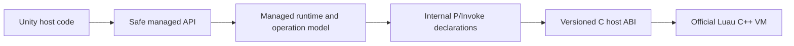

# Luau for Unity

A focused Unity runtime for the official Luau VM, with a safe managed API,
attribute-generated host libraries, and maintained Windows and Android plugins.


[](https://github.com/nuskey8/luau-dotnet/releases)
[](LICENSE)

> [!CAUTION]
> Luau for Unity is currently a preview. Breaking API cleanup may still occur.

## Architecture

The supported product is the package under
`src/Luau.Unity/Assets/Luau.Unity`. The repository's .NET projects build and
test that product; they are not a separate distribution.


```mermaid
flowchart LR
    Unity["Unity host code"] --> API["Safe managed API"]
    API --> Runtime["Managed runtime and operation model"]
    Runtime --> Interop["Internal P/Invoke declarations"]
    Interop --> ABI["Versioned C host ABI"]
    ABI --> VM["Official Luau C++ VM"]
```

The Unity package is authoritative for the internal C# declarations. The
`Luau.Interop` assembly uses `Luau.Internal.Interop` and mirrors only the narrow,
repository-owned `luau_host_*` ABI. It is not a consumer API.

`Luau.dll` is retained as a deterministic prebuilt Release artifact. It targets
`netstandard2.1`, and the net9 test harness consumes that same implementation.
Compiling the runtime as Unity source was rejected because the required compiler
and dependency accommodations would add more complexity than the copy step they
removed.

## Maintained Platforms

| Platform | Architecture | Native plugin | Verification gate |
| --- | --- | --- | --- |
| Windows | x64 | `luau_host.dll` | Editor, EditMode, Win64 IL2CPP smoke |
| Android | ARM64 | `libluau_host.so` | ARM64 IL2CPP device smoke |
| Android | x64 | `libluau_host.so` | x64 emulator smoke |

Only Windows x64 and Android ARM64/x64 are maintained. Import-name handling for
another Unity platform is not a support claim.

Before its first compile or state creation, the managed runtime verifies the
host's self-description, ABI layout, required features, pinned Luau revision,
and build fingerprint. The native binary exports only the approved
`luau_host_*` surface. See the
[Stage 3 implementation notes](docs/stage-3-implementation-notes.md) for the
native cutover record.

## Installation

In Unity Package Manager, choose **Add package from git URL** and enter:

```text
https://github.com/nuskey8/luau-dotnet.git?path=src/Luau.Unity/Assets/Luau.Unity
```

Or add the package to `Packages/manifest.json`:

```json
{
  "dependencies": {
    "com.nuskey.luau.unity": "https://github.com/nuskey8/luau-dotnet.git?path=src/Luau.Unity/Assets/Luau.Unity"
  }
}
```

## Quick Start

```csharp
using Luau.Unity;
using UnityEngine;

using var state = LuauUnity.CreateState();
var results = state.DoString("return 1 + 1", "@example/main.luau");
Debug.Log(results[0].Read<long>()); // 2
```

One root and all of its child threads are serialized. Independent roots may run
concurrently. The Unity facade captures the current Unity synchronization
context by default, so async continuations return to the Unity thread.

## Safe Host APIs

### Attribute-generated libraries

`[LuauLibrary]` and `[LuauMember]` are the single supported source-generation
model. Generated code performs typed conversion through `LuauCallContext`; it
does not use reflection, native handles, or raw stack operations.

```csharp
using Luau;

[LuauLibrary("ship")]
public partial class ShipApi
{
    [LuauMember("fuel")]
    public int Fuel { get; private set; } = 100;

    [LuauMember("consume")]
    public bool Consume(int amount)
    {
        if (amount < 0 || amount > Fuel)
            return false;

        Fuel -= amount;
        return true;
    }

    [LuauMember("refuelAsync")]
    public async ValueTask<int> RefuelAsync(
        int amount,
        CancellationToken cancellationToken)
    {
        await Task.Yield();
        cancellationToken.ThrowIfCancellationRequested();
        Fuel += amount;
        return Fuel;
    }
}
```

Register host libraries while configuring the root, before it is sandboxed:

```csharp
using var state = LuauUnity.CreateState(new LuauUnityOptions
{
    ConfigureHostApis = root => root.OpenLibrary(new ShipApi()),
});
```

Generated member names and signatures are validated at compile time. Generated
callbacks run under the same lifetime, cancellation, stack-boundary, and failure
rules as manual callbacks.

### Manual callbacks

Use manual callbacks only for small dynamic integrations that do not justify a
library type:

```csharp
state["clamp"] = state.CreateFunction("clamp", context =>
{
    var value = context.Read<double>(0);
    var minimum = context.Read<double>(1);
    var maximum = context.Read<double>(2);
    return context.Return(Math.Clamp(value, minimum, maximum));
});
```

`LuauCallContext` is callback-scoped and generation checked. Its argument indexes
are zero-based. It exposes typed `Read<T>`, typed `Return<T>`, cancellation, and
diagnostics—not a native handle, registry index, or mutable stack top. Retaining
it after callback completion fails deterministically.

For async callbacks, arguments are read and results are returned only while the
VM is safely suspended. The context remains generation checked across the
managed await and respects the root's continuation scheduler.

## Values and Functions

Script results are represented by `LuauValue`:

```csharp
var results = state.DoString("return 42, 'ready', true");

long answer = results[0].Read<long>();
string status = results[1].Read<string>();
bool ready = results[2].Read<bool>();
```

| Luau | Managed value |
| --- | --- |
| `nil` | `LuauValue.Nil` |
| `boolean` | `bool` |
| integer | signed `long` and range-checked smaller integers |
| number | `double` or `float` |
| vector | `System.Numerics.Vector3` |
| string | `string` |
| table | `LuauTable` |
| function | `LuauFunction` |
| userdata | `LuauUserData` |
| thread | `LuauState` |
| buffer | `LuauBuffer` |

VM-backed objects are root-owned references and must be disposed. Primitive
values are copied. `LuauBuffer.AsSpan()` is a borrowed view: do not retain it
across VM actions, collection, wrapper disposal, or root disposal.

Invoke a script function with managed values rather than manipulating its stack:

```csharp
using var function = state.DoString("return function(a, b) return a + b end")[0]
    .Read<LuauFunction>();

var results = await function.InvokeAsync([20, 22]);
Debug.Log(results[0].Read<long>()); // 42
```

## Sandboxing and Untrusted Content

The Luau sandbox is one part of host policy. For untrusted content:

- accept source instead of arbitrary bytecode;
- set finite source, bytecode, memory, execution, and result limits;
- expose only reviewed host APIs;
- keep OS, debug, and `require()` disabled unless the host explicitly grants
  those capabilities;
- register host APIs before root sandboxing;
- keep a host cancellation path;
- bound and rate-limit logging.

```csharp
using Luau;
using Luau.Unity;

using var state = LuauUnity.CreateState(new LuauUnityOptions
{
    StateOptions = new LuauStateOptions
    {
        MemoryLimitBytes = 16 * 1024 * 1024,
        MaxSourceBytes = 1024 * 1024,
        MaxBytecodeBytes = 1024 * 1024,
        BytecodePolicy = LuauBytecodePolicy.Reject,
        DefaultExecutionOptions = new LuauExecutionOptions
        {
            WallClockLimit = TimeSpan.FromMilliseconds(50),
            InterruptCountLimit = 10_000,
            MaxResultCount = 64,
        },
    },
});

var results = await state.DoStringAsync(
    untrustedSource,
    "@mods/example/main.luau".AsMemory(),
    cancellationToken: cancellationToken);
```

The limits above are examples; tune them against representative workloads.
Native VM memory accounting does not include arbitrary allocations performed by
managed callbacks.

Controlled failures use typed managed exceptions. The shared operation engine
restores its stack boundary and leaves the root reusable when safe; a failed
terminal reset poisons and disposes the entire root. Failure precedence is hard
stop, then managed callback failure, then allocator or native failure.

## Managed `require()`

`require()` is an opt-in managed host capability. It does not link Luau's native
Require implementation. The resolver controls aliases, paths, I/O, byte limits,
and trust. Module execution uses a fresh sandboxed child under a sandboxed root,
requires exactly one result, and caches results VM-wide without capturing a
sibling's private globals.

Unity includes resolvers for `Resources` and, when installed, Addressables:

```csharp
using var state = LuauUnity.CreateState(new LuauUnityOptions
{
    EnableRequire = true,
    Requirer = ResourcesLuauRequirer.Default,
});
```

There is no product filesystem resolver. A host needing filesystem I/O must own
and review that policy outside this package.

## Bytecode

Ordinary host-supplied bytecode is rejected by default. Untrusted content should
enter as source. Use explicitly trusted APIs only for bundled content whose
provenance the host has already established:

```csharp
var bytecode = LuauCompiler.Compile("return 42"u8);
using var function = state.LoadTrustedBytecode(
    bytecode,
    "@bundled/example.luau");
```

Unity's `LuauAsset` importer can precompile bundled `.luau` assets. Execute a
possibly precompiled bundled asset with `ExecuteTrusted`; use ordinary `Execute`
for source/untrusted assets. Byte-size limits still apply to trusted bytecode.

## Repository Validation

The repository is intentionally small: Unity is the product, and .NET is its
test harness.

```powershell
# Fast validation; never mutates package artifacts.
dotnet test Luau.slnx --no-restore

# Explicit deterministic Release artifact build/check/refresh.
powershell -ExecutionPolicy Bypass -File tools/Copy-DotNetArtifactsToUnity.ps1 -Configuration Release

# Unity compile and EditMode tests.
Push-Location src/Luau.Unity
ucp compile
ucp run-tests --mode edit
Pop-Location
```

Native plugins are built separately with the CMake presets under
`native/luau-host`. Managed refresh copies only `Luau.dll` and
`Luau.SourceGenerator.dll`; the package already owns its interop source.

See the [maintainer guide](docs/maintainer-guide.md) for authority boundaries,
operation semantics, and validation recipes.

## License

MIT
