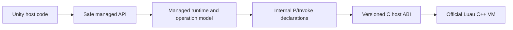

# Luau for Unity

A focused Unity runtime for the official Luau VM, with a safe managed API,
attribute-generated host libraries, and maintained Windows and Android plugins.


[](https://github.com/nuskey8/luau-dotnet/releases)
[](LICENSE)

> [!CAUTION]
> Luau for Unity is currently a preview. Breaking API cleanup may still occur.

## Architecture

The supported product is the package under
`src/Luau.Unity/Assets/Luau.Unity`. The repository's .NET projects build and
test that product; they are not a separate distribution.


```mermaid
flowchart LR
    Unity["Unity host code"] --> API["Safe managed API"]
    API --> Runtime["Managed runtime and operation model"]
    Runtime --> Interop["Internal P/Invoke declarations"]
    Interop --> ABI["Versioned C host ABI"]
    ABI --> VM["Official Luau C++ VM"]
```

The Unity package is authoritative for the internal C# declarations. The
`Luau.Interop` assembly uses `Luau.Internal.Interop` and mirrors only the narrow,
repository-owned `luau_host_*` ABI. It is not a consumer API.

`Luau.dll` is retained as a deterministic prebuilt Release artifact. It targets
`netstandard2.1`, and the net9 test harness consumes that same implementation.
Compiling the runtime as Unity source was rejected because the required compiler
and dependency accommodations would add more complexity than the copy step they
removed.

## Maintained Platforms

| Platform | Architecture | Native plugin | Verification gate |
| --- | --- | --- | --- |
| Windows | x64 | `luau_host.dll` | Editor, EditMode, Win64 IL2CPP smoke |
| Android | ARM64 | `libluau_host.so` | ARM64 IL2CPP device smoke |
| Android | x64 | `libluau_host.so` | x64 emulator smoke |

Only Windows x64 and Android ARM64/x64 are maintained. Import-name handling for
another Unity platform is not a support claim.

Before its first compile or state creation, the managed runtime verifies the
host's self-description, ABI layout, required features, pinned Luau revision,
and build fingerprint. The native binary exports only the approved
`luau_host_*` surface.

## Installation

In Unity Package Manager, choose **Add package from git URL** and enter:

```text
https://github.com/nuskey8/luau-dotnet.git?path=src/Luau.Unity/Assets/Luau.Unity
```

Or add the package to `Packages/manifest.json`:

```json
{
  "dependencies": {
    "com.nuskey.luau.unity": "https://github.com/nuskey8/luau-dotnet.git?path=src/Luau.Unity/Assets/Luau.Unity"
  }
}
```

## Quick Start

```csharp
using Luau.Unity;
using UnityEngine;

using var state = LuauUnity.CreateState();
var results = state.DoString("return 1 + 1", "@example/main.luau");
Debug.Log(results[0].Read<long>()); // 2
```

One root and all of its child threads are serialized. Independent roots may run
concurrently. The Unity facade captures the current Unity synchronization
context by default, so async continuations return to the Unity thread.

## Background Compilation

Downloaded source and SDK/editor preview source should normally be compiled
through Unity's package-owned background lane. It uses one bounded queue and a
dedicated managed worker, so native compilation does not block the Unity owner
thread:

```csharp
using Luau;
using Luau.Unity;

var compilation = await LuauUnity.CompileAsync(
    downloadedUtf8Source,
    cancellationToken: cancellationToken);

switch (compilation.Kind)
{
    case LuauCompileResultKind.Success:
        // Installing compiler output is a separate host decision. This helper
        // posts the VM operation to the state's configured owner scheduler.
        var values = await state.ExecuteCompilerOutputOnOwnerThreadAsync(
            compilation.Output!,
            "@mods/example/main.luau".AsMemory(),
            cancellationToken);
        break;

    case LuauCompileResultKind.Diagnostic:
        ShowAuthoringDiagnostic(compilation.Diagnostic!.Message);
        break;

    case LuauCompileResultKind.Canceled:
        break;

    case LuauCompileResultKind.InfrastructureFailure:
        throw compilation.InfrastructureException!;
}
```

The shared lane checks admission before taking its owned source snapshot. It
bounds the per-request source, per-result bytecode, incomplete request count,
aggregate incomplete source bytes, and worker count. Admission-limit failures throw
`LuauCompilationLimitException`; source diagnostics, cancellation, and backend
failures are distinct result kinds. Queued cancellation removes the work and
releases its reservation. A running native compile is never aborted: its output
is freed and discarded after the call returns.

`LuauUnity.CompileAsync` is available in both the Editor and player builds and
shares one package-owned lane. It selects one worker and 32 queue slots on
Windows/Editor, or one worker and 16 slots on Android. The package drains that
worker before Editor assembly reload and during player exit; callers never
dispose it.

An advanced host that needs an isolated queue, custom resource policy, or an
independent lifetime can construct `LuauThreadedCompilationService` directly,
usually with `LuauUnity.GetRecommendedCompilationOptions()` as its starting
policy. Such a service is caller-owned, is not tracked by Unity, and must be
disposed before its owning subsystem or Editor assembly lifetime ends. Windows
hosts may opt into a second worker only after representative stress testing.

Threads provide responsiveness and bounded admission, not crash, hang, hard
timeout, or compiler-intermediate-memory isolation. Copied output bytes are not
load capabilities and must not be placed into source-only mod packages. A
persistent first-party cache must create and later validate a
`LuauBytecodeArtifact` through the separate trust lane.

`LuauState.DoStringAsync` and the legacy source-asset `ExecuteAsync` overloads
still compile synchronously before asynchronous VM execution. Streamed source
should use `LuauUnity.CompileAsync`. The `LuauAsset` overload accepting an
`ILuauCompilationService` is available for advanced caller-owned lanes. Unity's
`ScriptedImporter` callback is synchronous and continues to compile transiently
for import diagnostics.

## Safe Host APIs

### Attribute-generated libraries

`[LuauLibrary]` and `[LuauMember]` are the single supported source-generation
model. Generated code performs typed conversion through `LuauCallContext`; it
does not use reflection, native handles, or raw stack operations.

```csharp
using Luau;

[LuauLibrary("ship")]
public partial class ShipApi
{
    [LuauMember("fuel")]
    public int Fuel { get; private set; } = 100;

    [LuauMember("consume")]
    public bool Consume(int amount)
    {
        if (amount < 0 || amount > Fuel)
            return false;

        Fuel -= amount;
        return true;
    }

    [LuauMember("refuelAsync")]
    public async ValueTask<int> RefuelAsync(
        int amount,
        CancellationToken cancellationToken)
    {
        await Task.Yield();
        cancellationToken.ThrowIfCancellationRequested();
        Fuel += amount;
        return Fuel;
    }
}
```

Register host libraries while configuring the root, before it is sandboxed:

```csharp
using var state = LuauUnity.CreateState(new LuauUnityOptions
{
    ConfigureHostApis = root => root.OpenLibrary(new ShipApi()),
});
```

Generated member names and signatures are validated at compile time. Generated
callbacks run under the same lifetime, cancellation, stack-boundary, and failure
rules as manual callbacks.

### Manual callbacks

Use manual callbacks only for small dynamic integrations that do not justify a
library type:

```csharp
state["clamp"] = state.CreateFunction("clamp", context =>
{
    var value = context.Read<double>(0);
    var minimum = context.Read<double>(1);
    var maximum = context.Read<double>(2);
    return context.Return(Math.Clamp(value, minimum, maximum));
});
```

`LuauCallContext` is callback-scoped and generation checked. Its argument indexes
are zero-based. It exposes typed `Read<T>`, typed `Return<T>`, cancellation, and
diagnostics—not a native handle, registry index, or mutable stack top. Retaining
it after callback completion fails deterministically.

For async callbacks, arguments are read and results are returned only while the
VM is safely suspended. The context remains generation checked across the
managed await and respects the root's continuation scheduler.

## Values and Functions

Script results are represented by `LuauValue`:

```csharp
var results = state.DoString("return 42, 'ready', true");

long answer = results[0].Read<long>();
string status = results[1].Read<string>();
bool ready = results[2].Read<bool>();
```

| Luau | Managed value |
| --- | --- |
| `nil` | `LuauValue.Nil` |
| `boolean` | `bool` |
| integer | signed `long` and range-checked smaller integers |
| number | `double` or `float` |
| vector | `System.Numerics.Vector3` |
| string | `string` |
| table | `LuauTable` |
| function | `LuauFunction` |
| userdata | `LuauUserData` |
| thread | `LuauState` |
| buffer | `LuauBuffer` |

VM-backed objects are root-owned references and must be disposed. Primitive
values are copied. `LuauBuffer.ToArray()`, `Read(...)`, and `Write(...)` copy
through bounded operations; no borrowed view of native buffer memory is exposed
across VM actions, collection, wrapper disposal, or root disposal.

Invoke a script function with managed values rather than manipulating its stack:

```csharp
using var function = state.DoString("return function(a, b) return a + b end")[0]
    .Read<LuauFunction>();

var results = await function.InvokeAsync([20, 22]);
Debug.Log(results[0].Read<long>()); // 42
```

## Sandboxing and Untrusted Content

The Luau sandbox is one part of host policy. For untrusted content:

- accept source instead of arbitrary bytecode;
- set finite source, bytecode, memory, execution, and result limits;
- expose only reviewed host APIs;
- keep OS, debug, and `require()` disabled unless the host explicitly grants
  those capabilities;
- register host APIs before root sandboxing;
- keep a host cancellation path;
- bound and rate-limit logging.

```csharp
using Luau;
using Luau.Unity;

// LuauUnityOptions already supplies finite memory, source, compiled-output,
// wall-clock, interrupt, result, and print-rate limits. Override the complete
// state policy only after measuring representative mods.
using var state = LuauUnity.CreateState(new LuauUnityOptions
{
    StateOptions = new LuauStateOptions
    {
        MemoryLimitBytes = 16 * 1024 * 1024,
        MaxSourceBytes = 1024 * 1024,
        MaxBytecodeBytes = 1024 * 1024,
        BytecodePolicy = LuauBytecodePolicy.Reject,
        DefaultExecutionOptions = new LuauExecutionOptions
        {
            WallClockLimit = TimeSpan.FromMilliseconds(50),
            InterruptCountLimit = 10_000,
            MaxResultCount = 64,
        },
    },
    MaxPrintMessagesPerSecond = 20,
});

var compilation = await LuauUnity.CompileAsync(
    untrustedSource,
    cancellationToken: cancellationToken);
if (compilation.Kind == LuauCompileResultKind.Diagnostic)
    throw compilation.Diagnostic!;
if (compilation.Kind == LuauCompileResultKind.Canceled)
    throw new OperationCanceledException(cancellationToken);
if (compilation.Kind == LuauCompileResultKind.InfrastructureFailure)
    throw compilation.InfrastructureException!;

var results = await state.ExecuteCompilerOutputOnOwnerThreadAsync(
    compilation.Output!,
    "@mods/example/main.luau".AsMemory(),
    cancellationToken);
```

The Unity defaults are conservative starting points; the tighter limits above
are examples. Tune them against representative workloads. Assigning a custom
`StateOptions` instance replaces the complete finite default policy, so keep
every required limit in that replacement.

Native VM memory accounting does not include arbitrary allocations performed by
managed callbacks.

Controlled failures use typed managed exceptions. The shared operation engine
restores its stack boundary and leaves the root reusable when safe; a failed
terminal reset poisons and disposes the entire root. Failure precedence is hard
stop, then managed callback failure, then allocator or native failure.

## Managed `require()`

`require()` is an opt-in managed host capability. It does not link Luau's native
Require implementation. Load and validate each mod package asynchronously
before creating its VM, then give that VM one copied, source-only module map.
Runtime module execution performs no filesystem, Resources, or Addressables I/O.
Module execution uses a fresh sandboxed child under a sandboxed root, requires
exactly one result, and caches one result per canonical module ID without
capturing a sibling's private globals.

```csharp
var moduleMap = new LuauModuleMap(
    new Dictionary<string, byte[]>
    {
        ["shared/math"] = sharedMathSourceUtf8,
        ["features/inventory"] = inventorySourceUtf8,
    },
    new Dictionary<string, string>
    {
        ["mod"] = "features",
    });

using var state = LuauUnity.CreateState(new LuauUnityOptions
{
    ModuleMap = moduleMap,
});
```

The map copies its source and aliases, canonicalizes equivalent IDs such as
`foo`, `./foo`, `/foo`, and `foo.luau`, and rejects parent traversal. There is no
product filesystem or global asset resolver. The host owns package I/O and
namespace policy outside the VM.

## Bytecode Trust Lanes

Raw host-supplied bytecode is not a public loading surface. Untrusted mods enter
as source, and `LuauBytecodePolicy.Reject` is both the default and the zero enum
value. Development output and persistent first-party artifacts use separate,
explicit APIs.

### Same-process compiler output

`LuauCompiler.Compile` returns a compiler-issued `LuauCompilerOutput`. It
cannot be reconstructed from bytes, so it can be loaded on a bytecode-rejecting
state for SDK tests, editor previews, and other same-process workflows.
Compilation diagnostics throw `LuauCompilationException`.

```csharp
var output = LuauCompiler.Compile("return 42"u8);
using var function = state.LoadCompilerOutput(
    output,
    "@development/example.luau");
```

Copying the output bytes does not create another load capability. Once output
crosses a process, build, cache, file, or asset-bundle boundary, it must use the
persistent artifact path below.

### Persistent first-party artifacts

Build tooling wraps compiler output in `LuauBytecodeArtifact`, including the
source and bytecode hashes, compile options, artifact schema, exact Luau/runtime
identity, and host-defined provenance metadata:

```csharp
var output = LuauCompiler.Compile(firstPartySource);
var artifact = LuauBytecodeArtifact.Create(
    output,
    "nervbox:first-party/v1",
    Encoding.UTF8.GetBytes(assetGuid));
```

Those fields are claims, not proof. Runtime loading requires a state configured
with `RequireValidator`; the validator must authenticate the artifact against
data owned by the game build, such as a signed manifest or a compiled hash
allowlist. It must not trust a provenance label, asset GUID, or hash merely
because the artifact contains it.

```csharp
var stateOptions = new LuauStateOptions
{
    MemoryLimitBytes = LuauStateOptions.Default.MemoryLimitBytes,
    MaxSourceBytes = LuauStateOptions.Default.MaxSourceBytes,
    MaxBytecodeBytes = LuauStateOptions.Default.MaxBytecodeBytes,
    DefaultExecutionOptions = LuauStateOptions.Default.DefaultExecutionOptions,
    BytecodePolicy = LuauBytecodePolicy.RequireValidator,
    BytecodeValidator = firstPartyManifestValidator,
};

using var firstPartyState = LuauUnity.CreateState(new LuauUnityOptions
{
    StateOptions = stateOptions,
});
using var function = firstPartyState.LoadVerifiedBytecode(
    artifact,
    "@bundled/example.luau");
```

The artifact constructor defensively copies serialized buffers and checks its
schema and bytecode hash. The state also checks the exact compiler/runtime
identity before invoking the host validator. Caller-provided chunk names are
diagnostic labels and never participate in provenance.

### Unity importer and mod packaging

The project setting under **Project Settings > Luau.Unity** has two modes:

- `SourceOnly` is the default for SDK and mod projects. The importer still
  compiles transiently to report authoring errors, but stores UTF-8 source and
  hides the precompile option.
- `AllowFirstPartyPrecompile` exposes a per-asset precompile option after a
  public first-party provenance ID is configured. The importer stores a
  persistent artifact containing that ID and the asset GUID; execution still
  requires the state's host validator.

Hiding a checkbox is not the security boundary. Source-only player builds
inspect imported content and fail if any `LuauAsset` contains bytecode. A custom
mod exporter should apply the same check to its exact asset set before writing:

```csharp
LuauSourceOnlyAssetValidator.ValidateSourceOnly(modAssetPaths);
```

Public `LuauAsset.AsSpan()` and `AsMemory()` remain source-only and throw for
precompiled or unknown content, so an existing source exporter cannot silently
package bytecode. The built-in `LuauModuleMap` also remains deliberately
source-only; a future first-party artifact module graph should use a separately
named trust path.

Future caches should key artifacts by source hash, compile options, artifact
schema, upstream revision, and host fingerprint, then re-enter through
`LoadVerifiedBytecode`. They must never recreate a `LuauCompilerOutput` from
cached raw bytes. See the
[background compilation plan](docs/plans/cross-platform-background-compilation.md)
for the cross-platform worker design.

## Repository Validation

The repository is intentionally small: Unity is the product, and .NET is its
test harness.

```powershell
# Fast validation; never mutates package artifacts.
dotnet test Luau.slnx --no-restore

# Explicit deterministic Release artifact build/check/refresh.
powershell -ExecutionPolicy Bypass -File tools/Copy-DotNetArtifactsToUnity.ps1 -Configuration Release
powershell -ExecutionPolicy Bypass -File tools/Copy-DotNetArtifactsToUnity.ps1 -Configuration Release -Check

# Static package, assembly-reference, and source-only policy checks used by CI.
powershell -ExecutionPolicy Bypass -File tools/Test-UnityPackageStatic.ps1

# After building/installing every maintained native preset, refresh/check the
# three Unity plugins without replacing their importer metadata.
powershell -ExecutionPolicy Bypass -File tools/Copy-NativeArtifactsToUnity.ps1
powershell -ExecutionPolicy Bypass -File tools/Copy-NativeArtifactsToUnity.ps1 -Check

# Compile the product from a clean path-only UPM consumer project.
powershell -ExecutionPolicy Bypass -File tools/Test-UnityPackageConsumer.ps1

# Unity compile and EditMode tests.
Push-Location src/Luau.Unity
ucp compile
ucp run-tests --mode edit
Pop-Location
```

Native plugins are built separately with the CMake presets under
`native/luau-host`. Managed refresh copies only `Luau.dll` and
`Luau.SourceGenerator.dll`; the package already owns its interop source.

See the [maintainer guide](docs/maintainer-guide.md) for authority boundaries,
operation semantics, and validation recipes.

## License

MIT
