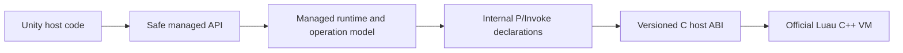

# Maintainer's guide to Luau for Unity

This guide describes the completed Unity-first architecture. Historical stage
plans explain how the repository reached it; they are not current build or
product instructions.

The design goal is the smallest useful set of boundaries: Unity-facing policy,
one managed lifetime and operation model, one internal managed/native contract,
one protected C host ABI, and the official Luau VM.

## 1. Architecture in one picture



There are no alternative product paths hidden behind this flow. Unity hosts do
not call native declarations. The managed runtime does not call upstream headers
directly. The host ABI does not own script-facing policy.

### Change the right layer

| Change | Authority |
| --- | --- |
| Script-facing policy/API | Safe managed API/runtime |
| Lifetime, callbacks, scheduling | Managed operation model |
| Managed/native contract | `luau_host.h` plus package interop |
| Long-jump/error containment | `luau_host.cpp` |
| Language behavior | Official pinned Luau submodule |
| Platform build | `native/luau-host` CMake/toolchains |
| Fast validation | .NET harness over product sources |

## 2. Repository map

| Path | Responsibility | Authority rule |
| --- | --- | --- |
| `Luau.Unity/` | Standalone UPM package | Product and package authority |
| `native/luau/` | Pinned official compiler and VM source | Do not patch language behavior in the host layer |
| `native/luau-host/` | Native build, protected ABI, export audit | Sole native build entry point |
| `native/luau-host/include/luau_host.h` | Complete C contract visible to managed code | Versioned compatibility authority |
| `Luau.Unity/Runtime/Interop/` | `Luau.Interop` and direct `luau_host_*` declarations | Sole C# interop source |
| `Luau.Unity/Runtime/Plugins/` | Maintained native plugins and importer metadata | Package-owned platform artifacts |
| `Luau.Unity/Runtime/` | Unity facade, `Luau.dll`, analyzer | Shipped managed product |
| `src/Luau/` | Canonical source for prebuilt `Luau.dll` | Managed runtime authority |
| `src/Luau.SourceGenerator/` | `[LuauLibrary]` / `[LuauMember]` generator | Sole host API generator |
| `tools/harness/` | Linked interop project and harness-only native artifact behavior | Never linked into Unity runtime source |
| `tests/Luau.Tests/` | Fast behavior, lifetime, failure, generator integration | Tests the shipped netstandard implementation from net9 |
| `Luau.Unity/Tests/` | Package-owned Unity tests | EditMode-specific coverage |
| `tests/Luau.Unity.Integration/` | Development and player-smoke Unity project | Consumes the standalone package; owns project-only assets and settings |
| `tests/Luau.Unity.PackageConsumerProbe/` | Minimal consumer source fixture | Copied into a generated disposable Unity project; not a maintained project |

The removed compatibility facade, duplicate interop tree, filesystem resolver,
call-site generator, and desktop tools are not extension points. If a change
appears to require restoring one, first verify that it belongs in an existing
authority above.

## 3. Native boundary

### 3.1 One build

`native/luau-host/CMakeLists.txt` is the entire native build entry point. It:

- verifies the exact clean Luau submodule revision;
- links only the required upstream static libraries;
- builds the repository-owned `luau_host` dynamic library;
- runs native conformance tests;
- audits the final binary against the 80-symbol allowlist.

Do not add a second build orchestrator or expose upstream `lua_*` functions.
Every managed/native capability must be reviewable in `luau_host.h`.

### 3.2 Contract classes

Each exported function is either:

1. a no-fail observer that cannot allocate, invoke Luau code, or raise; or
2. a protected operation returning `luau_host_status`.

The header documents stack effects and ownership. Native code contains all
long-jump and C++ exception paths before returning through P/Invoke. Error
payloads are inspected without forcing allocation in an exhausted VM.

### 3.3 ABI handshake

The first standalone compile or state creation verifies the native
self-description before crossing any other entry point. Managed validation
covers:

- ABI major/minor and record size;
- pointer width, packing, endianness, and fixed record sizes;
- required feature flags and value tags;
- pinned upstream revision and approved host build fingerprint.

An incompatible plugin fails before VM use. Keep
`native/luau-host/cmake/Write-ArtifactManifest.ps1` pointed at the canonical
package interop types and the managed ABI verifier whenever those files move.

### 3.4 Maintained artifacts

| Target | Package artifact | Runtime |
| --- | --- | --- |
| Windows x64 | `Luau.Unity/Runtime/Plugins/win-x64/luau_host.dll` | Windows Editor and Win64 player |
| Android ARM64 | `Luau.Unity/Runtime/Plugins/android-arm64/libluau_host.so` | Android ARM64 player |
| Android x64 | `Luau.Unity/Runtime/Plugins/android-x64/libluau_host.so` | Android x64 emulator |

These are the only maintained targets. Preserve each binary's `.meta` file and
review CPU/platform importer settings when installing a rebuilt artifact.

## 4. Package interop

The package owns the only interop source. `Luau.Interop` uses the internal
namespace `Luau.Internal.Interop` and contains direct declarations corresponding
to `luau_host.h`:

```text
Luau.Unity/Runtime/
    Interop/
        Luau.Interop.asmdef
        AssemblyInfo.cs
        NativeTypes.cs
        NativeMethods.cs
    Plugins/
        win-x64/
        android-arm64/
        android-x64/
```

Interop types and methods are internal. The prebuilt `Luau.dll` receives the one
friend relationship needed to call them. Consumer assemblies and generated game
assemblies do not.

`tools/harness/Luau.Interop.csproj` links the exact files under
`Luau.Unity/Runtime/Interop`. It may select and copy a test native artifact, but
it does not own declarations. Prefer normal platform probing; add harness-only
resolver code only when a validated harness case requires it. Unity always
resolves plugins through importer metadata.

The interop layer contains no upstream-shaped compatibility facade, conversion
policy, exception translation, stack abstraction, or consumer API. Those are
managed runtime responsibilities.

## 5. Managed lifetime model

One `LuauVmContext` owns a native root and all managed objects attached to it:

- child threads;
- registry-backed tables, functions, buffers, and userdata;
- callback registrations and native callback references;
- module cache;
- native allocator telemetry;
- sandbox bookkeeping;
- disposal cancellation;
- at most one active operation.

Disposing a root invalidates every descendant and closes native state exactly
once. Disposal of reference-backed wrappers during an active operation is
deferred until the operation reaches a safe point. Finalizers are fallback
cleanup, never the primary lifetime protocol.

VM access is serialized per root. Independent roots may execute concurrently.
When a continuation scheduler is configured, entry and continuation access must
occur through that scheduler.

## 6. One operation engine

`ScriptOperation` owns root-level execution state; `ScriptRunner` performs entry,
resume, callback injection, result transfer, and cleanup. The engine has three
entry modes:

| Mode | Use |
| --- | --- |
| `TopLevelResume` | Source/bytecode execution, function calls, coroutine resume |
| `NestedProtectedCall` | Managed module execution inside `require()` |
| `DirectHostOperation` | Global/table/metatable/display operations that may invoke Luau behavior |

The modes choose entry mechanics, not separate failure systems. All share:

- root active-operation ownership;
- scheduler enforcement and linked cancellation;
- interrupt and execution-budget observation;
- allocator and managed callback failure ownership;
- one explicit stack boundary;
- result-count validation;
- reset or terminal-root behavior;
- deferred reference release.

### 6.1 Stack boundary

Each entry captures its base top and explicitly tracks values it produces or
consumes. Success hands validated results to the caller. Managed failure restores
the owned base. If native reset fails, the boundary performs no further stack
action: the entire root becomes terminal and deferred close is the only remaining
native operation.

Review stack effects at each call site. The boundary is an ownership tool, not a
reason to hide pushes, consumes, or result counts.

### 6.2 Failure precedence

When multiple observations compete, the engine uses one deliberate order:

1. hard stop (disposal, caller cancellation, wall clock, interrupt budget);
2. managed callback failure;
3. allocator or native operation failure.

The same order applies to top-level, nested require, and direct host modes.
Structured tests assert exception type, chunk/callback identity, allocator
diagnostics, original/final stack top, and whether the root remains reusable.

### 6.3 Direct operations cannot suspend

A table/global/metamethod operation may run Luau code, so it joins the operation
engine even when called directly by a host. It may not suspend asynchronously.
If it yields, the engine aborts/resets it and reports a deliberate managed
failure. Do not reintroduce per-call `originalTop`/`restoreStack`/`resetAttempted`
blocks; extend the shared boundary instead.

## 7. Managed callbacks

### 7.1 Safe context

All public manual and generated callbacks use `LuauCallContext`. It is a small,
generation-checked callback value with:

- zero-based `ArgumentCount` and `Read<T>(index)`;
- typed `Return<T>` helpers;
- operation cancellation;
- an optional callback name for diagnostics.

It exposes no native handle, raw stack top, registry index, native callback
delegate, or arbitrary C-function push. Every operation validates the invocation
generation. Copies retained after completion fail deterministically.

A ref-like context is intentionally not used: it cannot represent the async
callback protocol supported by Unity. For async callbacks, the VM first yields
and unwinds from native resume; managed code then runs under the configured
scheduler. Typed arguments/results may be accessed only while that callback
generation is valid.

### 7.2 Callback failure protocol

Managed exceptions never cross reverse P/Invoke. A callback failure is recorded
against the active operation. The VM yields when possible, the managed runner
observes the failure after native control returns, and an opaque failure token is
injected only when Luau must observe the error through `pcall`.

An internal raw callback form exists only for runtime plumbing and focused tests.
It is not visible to package consumers or generated host libraries.

## 8. Host API generation

`[LuauLibrary]` on a top-level partial class plus `[LuauMember]` on explicit
members is the only source-generated API model:

```csharp
[LuauLibrary("ship")]
public partial class ShipApi
{
    [LuauMember("fuel")]
    public int Fuel { get; private set; }

    [LuauMember("consume")]
    public bool Consume(int amount) => amount <= Fuel;
}
```

Generated code is readable and AOT-safe. It performs:

- library instance registration;
- typed context reads and returns;
- context/cancellation injection;
- sync or awaited invocation;
- property/field get and set dispatch;
- readonly enforcement;
- root-table registration before sandboxing.

It performs no reflection, location-based call-site dispatch, native access, or direct
P/Invoke. Generator diagnostics reject unsupported declarations, duplicate or
invalid exported names, ambiguous overloads, init-only writes, and unsupported
generic/nested forms.

Generator tests cover sync/async and supported conversions, instance/static
members, fields/properties, readonly behavior, diagnostics, stable output, .NET
Roslyn compilation, Unity compilation, and IL2CPP execution.

The analyzer is a precompiled `Luau.SourceGenerator.dll` labeled
`RoslynAnalyzer` in Unity. Its `.meta` file remains part of the artifact identity.

## 9. Managed `require()`

`require()` remains an opt-in managed capability. Resolver implementations own
path/alias policy, I/O, byte limits, and source-versus-bytecode trust. The Unity
package supplies Resources and optional Addressables resolvers; it does not ship
a filesystem resolver.

Module execution:

1. resolves a VM-wide cache key;
2. creates a fresh child of the root, sandboxed when the root is sandboxed;
3. compiles/loads according to source or bytecode trust policy;
4. runs through `NestedProtectedCall` under the already-active root operation;
5. requires exactly one result;
6. caches that result at VM scope without retaining a caller's private global
   proxy.

Nested execution shares cancellation, budgets, callback ownership, allocator
translation, stack restoration, and terminal behavior with its parent. It does
not acquire a second root operation and does not use a private error translator.

## 10. Sandboxing and trust

Normal state factories default to:

- rejecting ordinary host-supplied bytecode;
- no OS or debug library;
- no `require()` until a resolver is explicitly installed;
- host API registration before root sandboxing;
- root sandboxing before untrusted children are returned;
- Unity continuation scheduling when created through `LuauUnity`;
- bounded Unity `print` formatting.

Sandboxing does not replace host policy. Untrusted workloads still require finite
input, memory, execution, and result limits; reviewed callbacks; logging policy;
and a cancellation path. Trusted bytecode and privileged libraries remain
explicitly named capabilities.

### 10.1 Background compilation

`ILuauCompilationService` is the backend-neutral boundary used by streamed-mod
and SDK/editor-preview code. `LuauThreadedCompilationService` is the first
backend. It owns a lock-protected queue and one or two long-lived background
threads; it never uses unrestricted `Task.Run` calls and never touches a
`LuauState`, Unity API, imported asset, caller buffer, or synchronization
context from a worker.

Admission copies UTF-8 source, snapshots compile options, then atomically
reserves both an incomplete-request slot and its source bytes. The immutable
service policy bounds:

- worker count (one by default, at most two);
- incomplete request count;
- aggregate source bytes held by incomplete requests;
- source bytes per request;
- bytecode bytes per result; and
- the finite shutdown drain period.

The Unity recommendation is one worker/32 slots for Windows Editor and Player,
or one worker/16 slots for Android ARM64/x64. The second Windows worker remains
an explicit host opt-in. Each host owns a service instance; there is no global
compiler service. The Unity factory weakly tracks only the instances it creates
so player exit and Editor assembly reload can request concurrent disposal and
report a finite aggregate drain timeout.

Cancellation is linearized with worker ownership. Pre-admission cancellation
creates no work. Queued cancellation physically removes the request and releases
its reservations. Running cancellation marks its native output for discard; it
does not abort the thread or interrupt `luau_host_compile`. The outcome commits
before publication; cancellation registration cleanup and result publication
then finish while the request remains inside the configured incomplete-request
and source-byte bounds. Later cancellation has no effect.
Shutdown rejects admission, cancels queued requests, and lets active native
calls finish. Every native output buffer is freed by `LuauCompiler`'s existing
`finally` path, including diagnostic, over-limit, and canceled/discarded output.

A successful `LuauCompileResult` contains the original compiler-issued
`LuauCompilerOutput`; copied bytes cannot reconstruct that same-process loading
capability. Diagnostics, cancellation, and infrastructure failure are separate
result kinds. Persistent caches still require `LuauBytecodeArtifact` plus host
provenance validation.

Compilation completion is not permission to enter a VM. Ordinary
`state.ExecuteAsync(asset)` calls compile through the package-owned lane, then
post installation to the state's configured continuation scheduler. Advanced
callers can provide an isolated service through
`ExecuteWithCompilationServiceAsync`. The services themselves remain VM-free,
so a later process-isolated backend does not change mod-streaming or cache code.

Threads solve owner-thread responsiveness and bounded admission. They do not
isolate native crashes, compiler hangs, or compiler intermediate memory, and
cannot enforce a hard timeout after native compilation starts. The native
conformance gate therefore proves concurrent independent-buffer ownership,
mixed valid/invalid stress, and serial/parallel deterministic output. Managed
tests cover admission, cancellation, disposal, and result-publication races.

Unity's `ScriptedImporter.OnImportAsset` contract remains synchronous. It still
compiles transiently for deterministic authoring diagnostics. Legacy
`DoStringAsync` compiles before its first await, while ordinary source-asset
`ExecuteAsync` uses the package-owned bounded background lane. Streaming code
that needs an independent queue or lifetime can construct a service and use the
explicit service-accepting asset overload.

## 11. Managed artifact decision

The package ships prebuilt Release `Luau.dll`. Direct source shipping was rejected
without a branch experiment because the authoritative source uses compiler and
framework features that would require broad syntax changes, extra package
dependencies, or a fragile custom compiler arrangement in Unity. That would
replace one explicit copy with a larger maintenance surface.

The final build relationship is:

- `src/Luau` builds one `netstandard2.1` artifact for Unity;
- net9 tests consume that exact target rather than a separate net9 library build;
- `Luau.SourceGenerator` remains a Unity-compatible analyzer assembly;
- the explicit artifact script checks/copies only `Luau.dll` and
  `Luau.SourceGenerator.dll`;
- package interop source is never copied because the package owns it;
- ordinary build/test commands never mutate package artifacts.

The stale-artifact check compares deterministic Release outputs with the
checked-in package DLLs. Do not hide refresh behavior in an MSBuild target.

## 12. Build and validation

### 12.1 Fast managed validation

```powershell
dotnet test Luau.slnx --no-restore
```

This covers managed values, lifecycle, hardening, operation modes, require,
callbacks, ABI rejection, background-compilation admission/cancellation races,
parallel determinism, and generator behavior without launching Unity.

### 12.2 Explicit managed refresh

```powershell
powershell -ExecutionPolicy Bypass -File tools/Copy-DotNetArtifactsToUnity.ps1 -Configuration Release
```

The command is the only normal path that may update the two checked-in managed
artifacts. Its check mode must fail when source and package outputs differ.

### 12.3 Native validation

Run from `native/luau-host`:

```powershell
cmake --preset windows-x64
cmake --build --preset windows-x64 --parallel
ctest --preset windows-x64

cmake --preset android-arm64
cmake --build --preset android-arm64 --parallel

cmake --preset android-x64
cmake --build --preset android-x64 --parallel
```

Installing a rebuilt plugin is a deliberate action separate from managed
refresh. Recheck exports, manifest identity, ABI handshake, and `.meta` importer
settings. Native conformance includes thousands of mixed concurrent compiler
calls and exact serial/parallel output comparison.

### 12.4 Package validation

```powershell
powershell -ExecutionPolicy Bypass -File tools/Test-UnityPackageStatic.ps1
powershell -ExecutionPolicy Bypass -File tools/Test-UnityPackageConsumer.ps1
```

The static check validates package boundaries and importer metadata without
launching Unity. The consumer check copies only
`tests/Luau.Unity.PackageConsumerProbe` into a generated disposable Unity
project, resolves the standalone package, compiles generated host bindings,
loads the native plugin, and executes a representative script. It is not a
second maintained Unity project.

### 12.5 Unity validation

Run from `tests/Luau.Unity.Integration`:

```powershell
ucp compile
ucp run-tests --mode edit
```

The required player gates are Windows x64 IL2CPP, Android ARM64 IL2CPP on a
device, and Android x64 on an emulator. The smoke includes background compile,
explicit Unity-owner scheduler handoff, and same-process output execution. A
successful build without the stable runtime pass marker is not a smoke pass.

See [Stage 4 implementation notes](stage-4-implementation-notes.md) for the
decision record and final verification record.

## 13. Common changes

### Change a public managed API

1. Update `src/Luau` or the Unity facade.
2. Update the public API baseline deliberately.
3. Add fast managed coverage and Unity coverage when package behavior changes.
4. Rebuild and check the two managed artifacts explicitly.

No public signature may expose interop types, pointers, native delegates, or raw
stack ownership.

### Change the native contract

1. Update `luau_host.h` with documented ownership and stack effects.
2. Update `luau_host.cpp` containment.
3. Update package interop directly.
4. Update ABI/layout/conformance/export tests and the manifest audit.
5. Rebuild each maintained plugin and review its `.meta` file.
6. Run all managed, Unity, and player gates.

Treat ABI version, host fingerprints, native binaries, and managed verifier as
one compatibility unit.

### Change generator behavior

1. Keep the attributed library model; do not add a second registration model.
2. Update semantic diagnostics and stable generated snapshots.
3. Compile representative output under .NET and Unity.
4. Exercise the result in the IL2CPP player smoke.

### Update upstream Luau

1. Update the `native/luau` submodule deliberately.
2. Review upstream behavior and ABI assumptions.
3. Rebuild all maintained native targets.
4. Update fingerprints/manifests as one compatibility unit.
5. Run native conformance, managed parity, Unity, and all player gates.

## 14. Invariants to defend

- Unity package code is the product authority.
- Package interop is the only C# declaration source.
- Only direct `luau_host_*` declarations cross managed/native.
- No public API exposes a native handle, pointer, delegate, or stack contract.
- One root owns every child, reference, callback, module, and operation.
- One operation engine owns every failure and stack boundary.
- Hard stops outrank callback failures; callback failures outrank
  allocator/native failures.
- Async managed work begins only after native resume has unwound.
- Generated host APIs are attributed, reflection-free, and IL2CPP-safe.
- `require()` remains managed, opt-in, sandbox-aware, and on the shared engine.
- Normal builds do not mutate the Unity package.
- Only Windows x64 and Android ARM64/x64 are maintained.

If a proposed convenience weakens one of these invariants, it belongs in a
separate design review rather than an incidental change.

## 15. Debugging by symptom

### Native plugin cannot be loaded

Check the maintained artifact path and its Unity importer metadata. In the .NET
harness, verify which Windows artifact `tools/harness` copied to the application
output. Do not add runtime probing code to the Unity package.

### ABI compatibility rejection

Treat this as a compatibility-unit mismatch. Compare the package interop,
managed verifier constants, native manifest, plugin hash, and pinned submodule.
Do not bypass the handshake.

### State reports another active operation

One root permits one active operation. Look for reentrant execution, access from
outside the configured scheduler, or a callback attempting to start top-level
execution on its own root.

### Retained call context throws

`LuauCallContext` is callback scoped. Read arguments and return results during
the active generation; copy durable managed values rather than retaining the
context.

### Direct table/global access reports a yield

Direct host operations cannot suspend. Move asynchronous behavior into a normal
Luau execution/callback flow instead of weakening the direct-operation mode.

### Root is disposed after a failure

The native reset failed and the root became terminal. The operation engine must
perform no further native action except deferred close. Preserve the original
typed failure and create a new root.

### Unity compiles but a player fails

Editor compilation does not prove player plugin selection, reverse callback
retention, analyzer output, or IL2CPP behavior. Inspect the target's `.meta`
settings and run the matching player smoke.
